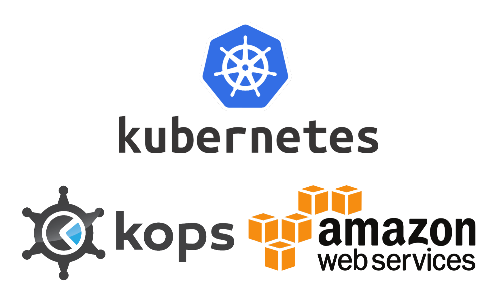
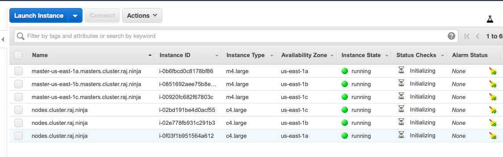
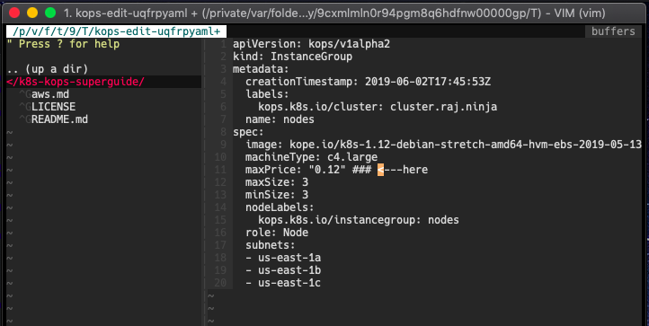

## Table of Contents

* [Pre-requisites](#Pre-requisites)

* [AWS Permissions](#Permissions)

* [Creating a Simple Cluster Specs](#Create-a-cluster-especification)

* [Apply and Create Cluster Specs](#Apply-cluster-specs)

* [Validating Cluster](#Validate-cluster)

* [Delete Cluster](#Delete-Cluster)

* [Another Options to Create Cluster](#Another-Options)

* [Using Spots](#Using-Spot-Instances-on-Nodes)

* [Setup Helm](#Setup-Helm-on-Master-from-Script)

* [Setup Auto Scale on Nodes](#Enable-Auto-Scale-on-Nodes)

## Pre-requisites

* A Route53 ex: `raj.ninja`
* A S3 Bucket to manage cluster state ex: `raj-teste-muito-louco`

## Permissions

You will need a EC2 Role, or User credentials with with this permissions

```
AmazonEC2FullAccess
AmazonRoute53FullAccess
AmazonS3FullAccess
IAMFullAccess
AmazonVPCFullAccess
```


## Create a cluster especification

```bash
kops create cluster \
    --node-count 3 \
    --zones us-east-1a,us-east-1b,us-east-1c \
    --networking weave \
    --name cluster.raj.ninja \
    --cloud aws \
    --state s3://raj-teste-muito-louco
```

* `node-count` : Quantity of nodes inside cluster
* `zones` : Zones separated by commas
* `networking` : Networking plugin. Ex: calico, canal, flannel, romana, cilium, weave
* `name` : Cluster DNS
* `cloud` : Cloud provider
* `state` : S3 Bucket


## Apply Cluster Specs

```bash
kops update cluster \
    --name cluster.raj.ninja \
    --state s3://raj-teste-muito-louco \
    --yes
```


## Validate Cluster

```bash
kops validate cluster cluster.raj.ninja \
    --state s3://raj-teste-muito-louco
```

```
Validating cluster cluster.raj.ninja

INSTANCE GROUPS
NAME			ROLE	MACHINETYPE	MIN	MAX	SUBNETS
master-us-east-1a	Master	m4.large	1	1	us-east-1a
nodes			Node	c4.large	3	3	us-east-1a,us-east-1b,us-east-1c

NODE STATUS
NAME				ROLE	READY
ip-172-20-37-240.ec2.internal	master	True
ip-172-20-63-253.ec2.internal	node	True
ip-172-20-82-127.ec2.internal	node	True
ip-172-20-96-100.ec2.internal	node	True

Your cluster cluster.raj.ninja is ready
```

## How to Connect on Master

by default, the master and nodes uses a Debian. The default user on VM's is `admin`

```bash
ssh admin@ip-do-master
```


```bash
kubectl get nodes
```

```
NAME                            STATUS   ROLES    AGE     VERSION
ip-172-20-51-235.ec2.internal   Ready    master   7m30s   v1.12.7
ip-172-20-61-17.ec2.internal    Ready    node     5m59s   v1.12.7
ip-172-20-79-42.ec2.internal    Ready    node     6m1s    v1.12.7
ip-172-20-97-13.ec2.internal    Ready    node     5m22s   v1.12.7
```

## Delete Cluster

```bash
kops delete cluster \
    cluster.raj.ninja \
    --state s3://raj-teste-muito-louco \
    --yes
```
------

## Another Options

```bash
kops create cluster \
    --master-size m4.large \
    --node-size c4.large \
    --master-count 1 \
    --node-count 3 \
    --api-loadbalancer-type public \
    --zones us-east-1a,us-east-1b,us-east-1c \
    --networking weave \
    --name cluster.raj.ninja \
    --cloud aws \
    --state s3://raj-teste-muito-louco \
    --yes
```

* `master-size` : Master instance class.
* `node-size` : Nodes instance class
* `master-count` : quantity of master on cluster
* `node-count` : quantity of nodes on cluster
* `api-loadbalancer-type` : API Management, on `public` or `private`


```
ip-172-20-37-240.ec2.internal   Ready    master   5m12s   v1.12.7
ip-172-20-63-253.ec2.internal   Ready    node     4m15s   v1.12.7
ip-172-20-82-127.ec2.internal   Ready    node     4m33s   v1.12.7
ip-172-20-84-135.ec2.internal   Ready    master   5m14s   v1.12.7
ip-172-20-96-100.ec2.internal   Ready    node     4m1s    v1.12.7
ip-172-20-96-163.ec2.internal   Ready    master   5m16s   v1.12.7
```



### Using a custom public key

```bash
kops create secret \
    --name cluster.raj.ninja \
    sshpublickey admin \
    -i ~/.ssh/id_rsa.pub \
    --state s3://raj-teste-muito-louco
```


### Using Spot Instances on Nodes

```bash
kops edit instancegroups nodes --state s3://raj-teste-muito-louco
```



```bash
kops update cluster --state s3://raj-teste-muito-louco --yes
```

```bash
kops rolling-update cluster --state s3://raj-teste-muito-louco --yes
```

### Setup Helm on Master from Script

* Install Helm from script
```
curl -L https://git.io/get_helm.sh | bash
helm init
```

* Setup Tiller
```
kubectl create serviceaccount --namespace kube-system tiller
kubectl create clusterrolebinding tiller-cluster-rule --clusterrole=cluster-admin --serviceaccount=kube-system:tiller
helm init --service-account tiller
```

### Enable Auto Scale on Nodes

* Edit nodes specs

```bash
kops edit ig nodes --state s3://raj-teste-muito-louco
```
* And add this specs changing the cluster name

```yml
spec:
  cloudLabels:
    k8s.io/cluster-autoscaler/enabled: ""
    k8s.io/cluster-autoscaler/node-template/label: ""
    kubernetes.io/cluster/<CLUSTER_NAME>: owned

```

* Edit cluster specs

```bash
kops edit cluster --state s3://raj-teste-muito-louco
```

And add this policies

```yml
spec:
  additionalPolicies:
    node: |
      [
        {
          "Effect": "Allow",
          "Action": [
            "autoscaling:DescribeAutoScalingGroups",
            "autoscaling:DescribeAutoScalingInstances",
            "autoscaling:SetDesiredCapacity",
            "autoscaling:DescribeLaunchConfigurations",
            "autoscaling:DescribeTags",
            "autoscaling:TerminateInstanceInAutoScalingGroup"
          ],
          "Resource": ["*"]
        }
      ]
```

* Update cluster

```bash
kops update cluster --state s3://raj-teste-muito-louco --yes
```

```bash
kops rolling-update cluster --state s3://raj-teste-muito-louco --yes
```
